# Telegram营销机器人完整部署与问题排查指南

## 项目概述

这是一个基于Node.js的Telegram营销机器人系统，支持商家信息管理、预约功能、群组推广等核心功能。

### 技术栈
- **后端**: Node.js 18+, Express
- **数据库**: SQLite3 (better-sqlite3)
- **Bot框架**: node-telegram-bot-api
- **定时任务**: node-cron
- **部署平台**: Railway (Docker容器化)
- **环境管理**: dotenv

## 项目结构

```
kitelegrambot/
├── admin/                  # 管理后台
│   ├── admin-legacy.html   # 管理界面
│   ├── orders.html         # 订单管理
│   ├── scripts/           # 前端脚本
│   └── styles/            # 样式文件
├── config/
│   └── database.js        # 数据库配置
├── models/
│   ├── databaseSchema.js  # 数据库表结构
│   └── dbOperations.js    # 数据库操作
├── services/              # 核心服务
│   ├── apiService.js      # API服务
│   ├── botService.js      # Bot核心逻辑
│   ├── httpService.js     # HTTP服务与消息发送
│   ├── orderService.js    # 订单管理
│   └── [其他服务...]
├── utils/                 # 工具函数
├── data/                  # 数据存储目录
├── app.js                 # 应用入口
├── package.json           # 项目配置
├── Dockerfile             # Docker构建文件
├── railway.toml           # Railway部署配置
└── env.example            # 环境变量模板
```

## 核心功能流程

### 1. 商家信息推广流程

```mermaid
graph TD
    A[管理后台] --> B[测试发送商家信息]
    B --> C[群组显示商家信息 + 出击按钮]
    C --> D[用户点击出击按钮]
    D --> E[跳转到Bot私聊]
    E --> F[发送 /start merchant_123]
    F --> G[Bot显示详细商家信息]
    G --> H[用户点击预约按钮]
    H --> I[进入预约流程]
```


### 2. 数据库字段映射
**关键字段对应关系**:
- `region_name` ✅ (不是 `region`)
- `teacher_name` ✅ (不是 `stage_name`)
- `school_name` ✅ (不是 `school`)
- `contact_info` ✅ (不是 `contact`)
- `address` ✅ (确认存在)

## 环境配置

### 必需环境变量
```bash
# 从 @BotFather 获取
BOT_TOKEN=your_bot_token_here

# Bot用户名（不含@符号）
BOT_USERNAME=xiaojisystemBOT

# HTTP服务端口
PORT=3000

# 群组Chat ID（负数格式）
GROUP_CHAT_ID=-1002793326688
```

### package.json 配置
```json
{
  "name": "telegram-marketing-bot",
  "version": "1.0.0",
  "main": "app.js",
  "engines": {
    "node": ">=18.0.0",
    "npm": ">=8.0.0"
  },
  "dependencies": {
    "better-sqlite3": "^8.7.0",
    "dotenv": "^16.5.0",
    "node-cron": "^3.0.2",
    "node-telegram-bot-api": "^0.61.0"
  }
}
```

## 部署配置

### Docker容器化 (Dockerfile)
```dockerfile
FROM node:18-alpine
WORKDIR /app

# 安装系统依赖（better-sqlite3需要）
RUN apk add --no-cache python3 make g++

# 安装依赖
COPY package*.json ./
RUN npm ci --only=production

# 复制项目文件
COPY . .

# 创建数据目录并设置权限
RUN mkdir -p data && chown -R node:node /app
USER node

# 健康检查
HEALTHCHECK --interval=30s --timeout=3s --start-period=5s --retries=3 \
  CMD wget --no-verbose --tries=1 --spider http://localhost:3000/health || exit 1

EXPOSE 3000
CMD ["npm", "start"]
```

### Railway部署 (railway.toml)
```toml
[build]
builder = "dockerfile"

[deploy]
startCommand = "npm start"
restartPolicyType = "always"
restartPolicyMaxRetries = 10
healthcheckPath = "/health"
healthcheckTimeout = 30

[env]
NODE_ENV = "production"
```

### Git配置 (.gitignore)
```gitignore
# 依赖
node_modules/
npm-debug.log*

# 环境变量
.env
.env.local
.env.production

# 数据库文件
*.db
*.sqlite
data/

# 日志文件
*.log
logs/

# 临时文件
.tmp/
temp/

# IDE配置
.vscode/
.idea/

# 系统文件
.DS_Store
Thumbs.db
```

### Docker忽略 (.dockerignore)
```dockerignore
node_modules
npm-debug.log
.env
.env.local
.git
.gitignore
README.md
Dockerfile
.dockerignore
data/*.db
*.log
```

## 常见问题排查

### 1. 数据库字段不匹配问题

**症状**: 商家信息显示"undefined"，测试发送功能异常

**排查步骤**:
1. 检查 `httpService.js` 中的字段映射
2. 确认数据库实际字段名
3. 验证数据获取逻辑

**修复模板**:
```javascript
// httpService.js - 正确的商家信息构建
const merchantInfo = `
🏫 ${merchant.school_name || '未设置'}
👨‍🏫 老师：${merchant.teacher_name || '未设置'}
📍 地区：${merchant.region_name || '未设置'}
📞 联系方式：${merchant.contact_info || '未设置'}
📍 地址：${merchant.address || '未设置'}
`;

// 群组按钮配置（URL跳转类型）
const keyboard = {
    inline_keyboard: [[{
        text: "出击！",
        url: `https://t.me/${botUsername}?start=merchant_${merchantId}`
    }]]
};
```

### 2. 按钮跳转问题

**按钮类型选择规则**:
- **群组消息**: 使用 `url` 类型，跳转到私聊
- **私聊消息**: 使用 `callback_data` 类型，直接处理

**深度链接格式**:
```
https://t.me/{botUsername}?start=merchant_{merchantId}
```

### 3. 部署环境问题

**Railway部署检查清单**:
- [ ] 环境变量配置完整
- [ ] Dockerfile构建成功
- [ ] 健康检查路径正确
- [ ] 数据库文件权限正确
- [ ] Bot Token有效

### 4. 数据库连接问题

**SQLite配置检查**:
```javascript
// database.js
const Database = require('better-sqlite3');
const path = require('path');

const dbPath = process.env.DB_PATH || path.join(__dirname, '../data/marketing_bot.db');
const db = new Database(dbPath);

// 确保数据目录存在
const fs = require('fs');
const dataDir = path.dirname(dbPath);
if (!fs.existsSync(dataDir)) {
    fs.mkdirSync(dataDir, { recursive: true });
}
```

## 快速排查命令

### 数据库字段不匹配问题诊断提示词

```
当Telegram Bot出现商家信息显示"undefined"时，按以下步骤排查：

1. 检查数据库字段名是否匹配：
   - region_name (不是 region)
   - teacher_name (不是 stage_name)
   - school_name (不是 school)
   - contact_info (不是 contact)

2. 修复httpService.js中的字段引用

3. 确认按钮类型：
   - 群组: url类型按钮
   - 私聊: callback_data类型按钮

4. 验证BOT_USERNAME环境变量配置

5. 测试完整流程：
   管理后台 → 群组推送 → 私聊跳转 → 预约功能
```

## 部署步骤

### 1. 本地开发
```bash
# 克隆项目
git clone <repository>
cd kitelegrambot

# 安装依赖
npm install

# 配置环境变量
cp env.example .env
# 编辑.env文件填入实际值

# 启动开发
npm run dev
```

### 2. Railway部署
```bash
# 推送到GitHub
git add .
git commit -m "部署版本"
git push origin main

# Railway会自动检测railway.toml配置进行部署
# 确保在Railway面板中配置环境变量
```

### 3. 部署后验证
- [ ] Bot响应 `/start` 命令
- [ ] 管理后台可访问
- [ ] 数据库操作正常
- [ ] 群组消息发送正常
- [ ] 私聊跳转功能正常

## 监控与维护

### 日志监控
```bash
# 查看应用日志
npm run logs

# 检查进程状态
npm run status

# 重启服务
npm run restart
```

### 健康检查
Railway会通过 `/health` 端点进行健康检查，确保应用正常运行。

### 数据备份
定期备份 `data/` 目录下的数据库文件，确保数据安全。

---

**注意**: 此文档涵盖了完整的项目配置、部署流程和问题排查方案。遇到问题时，按照对应章节的步骤进行排查和修复。 